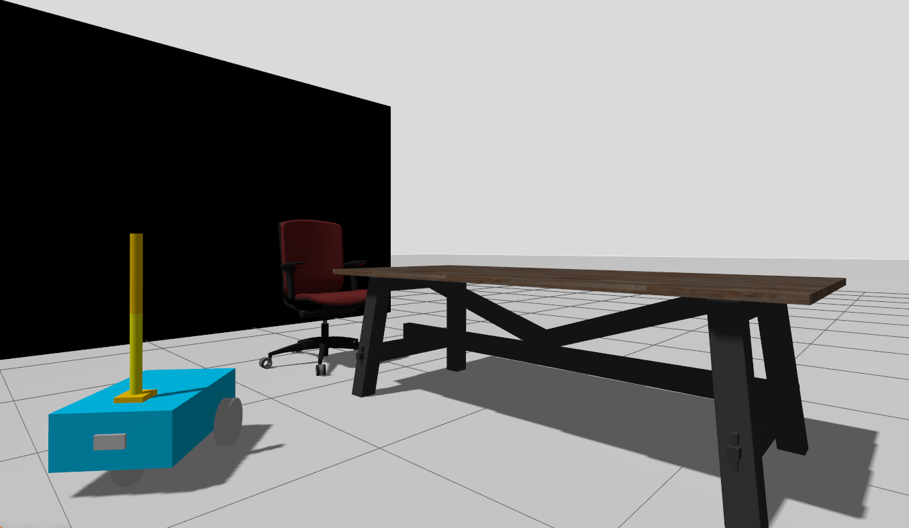
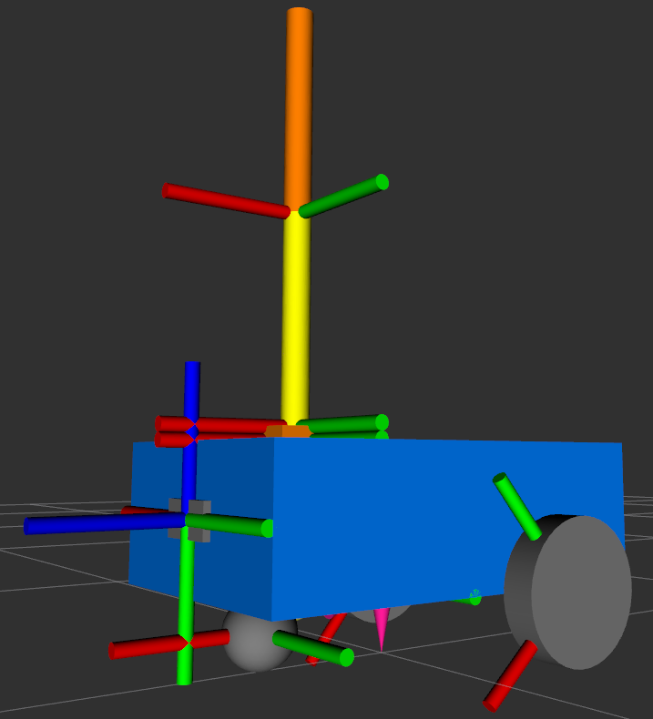

# ROS 2 Differential Drive Robot With 2-Link Arm

> ROS 2 + Gazebo simulation of a differential drive mobile robot with a simple 2-link arm and camera sensor.

This project demonstrates a ROS 2 + Gazebo simulation of a differential drive mobile robot. The robot has a two-wheel differential drive base, a caster wheel, a simple 2-link arm mounted on the base, and a front camera sensor.

The robot model is written with URDF/Xacro, visualized in RViz, and simulated in Gazebo using `ros_gz_sim` and `ros_gz_bridge`.

## Simulation

### Gazebo



### RViz



## Gazebo World and Physics

The simulation uses a custom Gazebo world from:

```text
src/my_robot_bringup/worlds/test_world.sdf
```

Gazebo does more than just show the robot visually. It also simulates basic physics, so the robot has mass, wheels, collision shapes, and contact with the ground. This means the robot can collide with objects and behave more like a real robot in a real environment.

## Features

- Differential drive mobile base
- Simple 2-link robotic arm
- Front camera sensor
- URDF/Xacro robot description
- Gazebo simulation world
- Collision and physics simulation
- RViz visualization
- ROS-Gazebo bridge for topics
- Launch files for easy startup

## Project Structure

```text
.
├── images/
│   ├── Gazebo.png
│   └── RViz.png
├── src/
│   ├── my_robot_bringup/
│   │   ├── config/
│   │   │   └── gazebo_bridge.yaml
│   │   ├── launch/
│   │   │   └── my_robot_gazebo.launch.xml
│   │   └── worlds/
│   │       └── test_world.sdf
│   └── my_robot_description/
│       ├── launch/
│       ├── rviz/
│       └── urdf/
└── README.md
```

## Packages

### `my_robot_description`

Contains the robot model files:

- `urdf/my_robot.urdf.xacro` - main robot file
- `urdf/mobile_base.xacro` - robot base, wheels, caster, and arm mounting
- `urdf/arm.urdf.xacro` - 2-link arm model
- `urdf/camera.xacro` - camera sensor model
- `rviz/` - RViz configuration files
- `launch/` - launch files for viewing the robot model

### `my_robot_bringup`

Contains files used to run the full simulation:

- `launch/my_robot_gazebo.launch.xml` - starts Gazebo, spawns the robot, starts the bridge, and opens RViz
- `worlds/test_world.sdf` - custom Gazebo world
- `config/gazebo_bridge.yaml` - bridges topics between Gazebo and ROS 2

## Requirements

This project is made for ROS 2 with Gazebo Sim.

You need:

- Ubuntu with ROS 2 installed
- `colcon`
- `xacro`
- `robot_state_publisher`
- `joint_state_publisher_gui`
- `rviz2`
- `ros_gz_sim`
- `ros_gz_bridge`
- `teleop_twist_keyboard`

For example, on a ROS 2 system you can install the common tools with:

```bash
sudo apt update
sudo apt install ros-${ROS_DISTRO}-xacro \
                 ros-${ROS_DISTRO}-robot-state-publisher \
                 ros-${ROS_DISTRO}-joint-state-publisher-gui \
                 ros-${ROS_DISTRO}-rviz2 \
                 ros-${ROS_DISTRO}-ros-gz-sim \
                 ros-${ROS_DISTRO}-ros-gz-bridge \
                 ros-${ROS_DISTRO}-teleop-twist-keyboard
```

`ROS_DISTRO` should already be set after sourcing ROS 2. You can check it with:

```bash
echo $ROS_DISTRO
```

## How to Run

### 1. Clone the repository

```bash
git clone https://github.com/JayGajjar890/ros2-diff-drive-arm-simulation.git
cd ros2-diff-drive-arm-simulation
```

### 2. Source ROS 2

Replace `jazzy` with your ROS 2 version if you use a different one.

```bash
source /opt/ros/jazzy/setup.bash
```

### 3. Build the workspace

```bash
colcon build
```

### 4. Source the workspace

```bash
source install/setup.bash
```

### 5. Launch the full Gazebo simulation

```bash
ros2 launch my_robot_bringup my_robot_gazebo.launch.xml
```

This command will:

- Start Gazebo with the custom world
- Spawn the robot
- Start `robot_state_publisher`
- Start the ROS-Gazebo bridge
- Open RViz with the robot configuration

## Control the Robot

After launching the simulation, open another terminal and source the workspace again:

```bash
source /opt/ros/jazzy/setup.bash
source install/setup.bash
```

### Move the mobile base

The easiest way to control the robot is with the keyboard using `teleop_twist_keyboard`.

In a new terminal, source ROS 2 and your workspace:

```bash
source /opt/ros/jazzy/setup.bash
source install/setup.bash
```

Then run:

```bash
ros2 run teleop_twist_keyboard teleop_twist_keyboard
```

Use the keys shown in the terminal to move the robot. Keep the teleop terminal selected while driving.

If you want to test movement manually, you can also send velocity commands directly to `/cmd_vel`.

Move forward:

```bash
ros2 topic pub /cmd_vel geometry_msgs/msg/Twist "{linear: {x: 0.3}, angular: {z: 0.0}}" -r 10
```

Turn the robot:

```bash
ros2 topic pub /cmd_vel geometry_msgs/msg/Twist "{linear: {x: 0.0}, angular: {z: 0.5}}" -r 10
```

Stop the robot:

```bash
ros2 topic pub /cmd_vel geometry_msgs/msg/Twist "{linear: {x: 0.0}, angular: {z: 0.0}}" -1
```

### Move the arm joints

Move the first arm joint:

```bash
ros2 topic pub /joint0/cmd_pos std_msgs/msg/Float64 "{data: 0.7}" -1
```

Move the second arm joint:

```bash
ros2 topic pub /joint1/cmd_pos std_msgs/msg/Float64 "{data: 0.5}" -1
```

The arm joint limits are from `0` to about `1.57` radians, which is 0 to 90 degrees.

## Camera Topics

The camera publishes these ROS 2 topics:

```text
/camera/image_raw
/camera/camera_info
```

To check if images are being published:

```bash
ros2 topic list
ros2 topic hz /camera/image_raw
```

## Useful Commands

List all active topics:

```bash
ros2 topic list
```

Check the transform tree:

```bash
ros2 run tf2_tools view_frames
```

View joint states:

```bash
ros2 topic echo /joint_states
```

Open only the robot model in RViz:

```bash
ros2 launch my_robot_description display.launch.xml
```

Open only the arm model in RViz:

```bash
ros2 launch my_robot_description arm.launch.xml
```

## Beginner Explanation

- `URDF` describes the robot links and joints.
- `Xacro` makes URDF easier to write by using variables and reusable blocks.
- `Gazebo` simulates the robot physics and sensors.
- `RViz` shows the robot model, TF frames, and sensor data from ROS.
- `robot_state_publisher` publishes the robot transforms from the URDF.
- `ros_gz_bridge` connects Gazebo topics with ROS 2 topics.
- `colcon build` builds the ROS 2 workspace.
- `source install/setup.bash` tells the terminal where to find your built packages.

## Troubleshooting

### Package not found

If you see an error like `package 'my_robot_bringup' not found`, source the workspace:

```bash
source install/setup.bash
```

### Command not found

If `ros2` or `colcon` is not found, source ROS 2 first:

```bash
source /opt/ros/jazzy/setup.bash
```

### Gazebo or bridge package missing

Install the Gazebo ROS packages:

```bash
sudo apt install ros-${ROS_DISTRO}-ros-gz-sim ros-${ROS_DISTRO}-ros-gz-bridge
```

### Rebuild after changing URDF, launch, or config files

```bash
colcon build
source install/setup.bash
```

## Notes

- Build and run commands should be executed from the repository root.
- Only the source files are needed in GitHub. The `build/`, `install/`, and `log/` folders are created automatically after running `colcon build`.
- The main launch file is:

```bash
ros2 launch my_robot_bringup my_robot_gazebo.launch.xml
```
